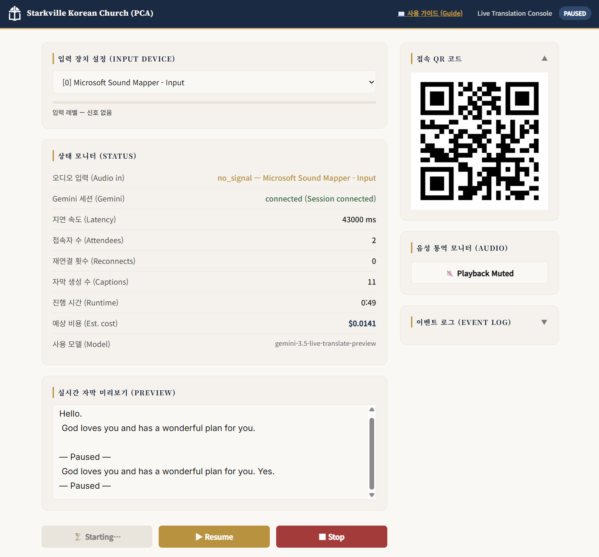
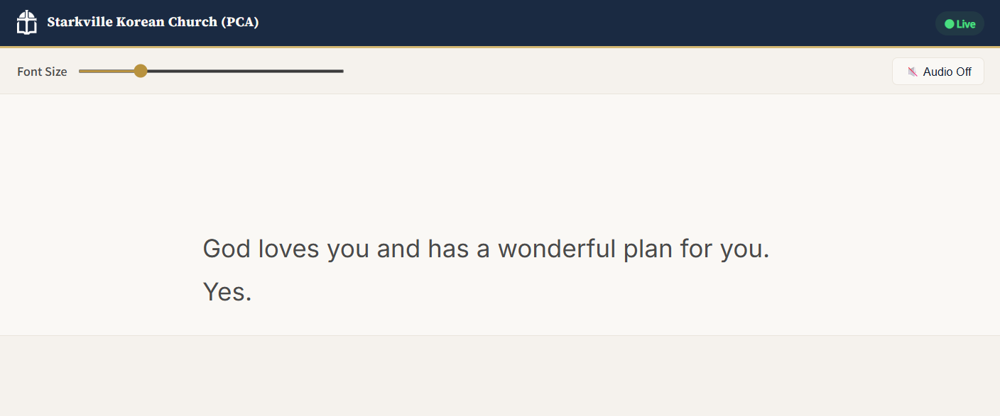

# Live Translation System / 실시간 예배 번역 시스템

[🐍 Python](https://www.python.org/) | [⚡ FastAPI](https://fastapi.tiangolo.com/) | [🎙️ PyAudio](https://people.csail.mit.edu/hubert/pyaudio/) | [♊ Gemini Live API](https://ai.google.dev/gemini-api/docs/live-api) | [🔊 Web Audio API](https://developer.mozilla.org/en-US/docs/Web/API/Web_Audio_API) | [💬 Server-Sent Events](https://developer.mozilla.org/en-US/docs/Web/API/Server-sent_events)

This is a real-time Korean to English translation system for church services. It captures audio from a microphone input, translates it using the Google Gemini Live API, and streams captions and audio to attendees' mobile web browsers over a local WiFi network. It was originally created for Starkville Korean Church (PCA) but can be set up for other churches.
예배용 실시간 한영 번역 시스템입니다. 마이크 오디오 입력을 캡처하고 Google Gemini Live API를 통해 번역하여 로컬 WiFi 네트워크 내의 참석자 모바일 브라우저로 자막과 오디오를 스트리밍합니다. 스탁빌 한인 교회(PCA)를 위해 제작되었으나 다른 교회에서도 설정하여 사용할 수 있습니다.

---

## 📖 문서 가이드 디렉토리 / Documentation Directory

시스템 운영, 유지보수 및 편집을 위한 모든 세부 문서는 아래 개별 가이드로 분리되어 관리됩니다. 필요한 가이드의 링크를 클릭하여 확인하십시오.
All detailed guides for running, maintaining, and editing the system are managed in separate files below. Click on the hyperlinks to access them.

### 👥 1. 봉사자 및 운영자용 / For Operators & Volunteers

* **[실시간 번역 시스템 사용 가이드 / Bilingual Volunteer Guide](docs/HOW_TO_USE.md)**
  * 봉사자가 마이크 입력 확인, 시작 및 중지 조작, QR 코드 제공 등을 할 수 있는 운영 매뉴얼입니다.
  * An operator manual for volunteers to check mic inputs, start/stop translation, and share the QR code.
  * **[📝 사용 가이드 열기 / Open Volunteer Guide →](docs/HOW_TO_USE.md)**

### 🛠️ 2. 기술 유지보수자용 / For Technical Maintainers

* **[기술 유지보수 및 아키텍처 플랜 / Technical Maintainer & Architecture Plan](docs/PLAN.md)**
  * FastAPI 서버 구조, PyAudio 캡처 파이프라인, 제미나이 Live API 세션 복구(Session Resumption), 슬라이딩 윈도우 컨텍스트 압축 등 개발자 지침서입니다.
  * System architecture, FastAPI server structure, PyAudio capture pipelines, Gemini Live API session resumption, sliding window context compression, and developer specifications.

* **[개발 빌드 및 히스토리 로그 / Build Workthrough & History Log](docs/WORKTHROUGH.md)**
  * 모델 선정, 검증 테스트, 요금 정보 업데이트 및 다국어 지원에 대한 개발 일지입니다.
  * A chronological build log documenting model selections, verification testing, pricing updates, and multi-language support implementation.


### 🔐 3. 운영 및 소유권 관리 / Site Governance & API Key Registry

* **사이트 운영 및 비밀키 관리 / System Governance & Credentials**
  * **API 키 발급 및 등록 / API Key Procurement**: [Google AI Studio](https://aistudio.google.com/)에서 API 키를 발급받고 결제 정보(Billing)를 등록해야 합니다. 무료 키는 60분 연속 가동 시 분당 한도 초과로 자막 중단이 발생할 수 있습니다.
  * **환경 변수 파일 설정 / Environment Configuration**: 발급받은 키는 프로젝트 루트 디렉토리의 `.env` 파일에 `GEMINI_API_KEY=your_key` 형태로 저장하여 보안을 관리합니다.
  * **로컬 인프라 제어 / Local Device Binding**: `config.yaml` 파일을 통해 로컬 PC의 입력 믹서 인덱스 등을 지정합니다.
  * **소유권 이양 / Governance & Handoff**: 교회 시스템의 영속성을 위해 GitHub 권한과 Google Billing 소유권을 다음 유지보수자에게 안전하게 인계하는 원칙을 정의합니다.
  * **API Key Procurement**: API keys must be generated via [Google AI Studio](https://aistudio.google.com/) with **Billing enabled (Paid Tier)**. Free keys will hit rate limits and fail during standard 60+ minute church services.
  * **Environment Configuration**: Keys are secured locally in a `.env` file (`GEMINI_API_KEY=your_key`) at the root directory.
  * **Local Device Binding**: Local mixer device configurations are bound via the local `config.yaml` file.
  * **Governance & Handoff**: Outlines access rights transfer, repository delegation, and billing ownership handover rules for future church volunteers.

---

## 🖥️ 사용자 및 관리자 화면 구성 / User & Operator Interfaces

### 1. 관리자 제어 콘솔 / Operator Control Console (`/`)
참석자용 QR 코드 생성, 오디오 입력 기기 설정 및 제미나이 번역 엔진의 시작/일시정지/종료 제어 등을 담당하는 중앙 관리 화면입니다.
This page acts as the central control room for volunteers to generate attendee QR codes, bind local audio devices, and start/mute/stop the Gemini Live session.



* **주요 요소 설명 / Element Explanations**:
  * **오디오 장치 설정 (Audio Device Index)**: 현재 Windows PC에 연결된 오디오 입력 장치 번호를 입력하고 저장합니다.
  * **제어 스위치 (Start / Pause / Stop)**:
    * `Start`를 눌러 AI 번역 세션을 열고, 예배 도중 잠시 멈출 때는 `Pause`를, 예배 종료 시엔 `Stop`을 눌러 자막 텍스트 저장을 수행합니다.
  * **레벨 미터 & 상태 표시 (Level Meter & Status Logs)**: 마이크 입력 감도를 측정하는 실시간 데시벨(dB) 게이지와 Gemini API 통신 상태를 실시간 콘솔 로그로 모니터링합니다.
  * **음성 통역 모니터 (Audio Monitor)**: 관리자가 헤드폰이나 이어폰을 착용하고 실제 참석자들에게 송출되는 실시간 영어 번역 음성 스트림을 서버 PC에서 실시간으로 모니터링하고 볼륨을 제어할 수 있는 채널입니다. (Allows the operator to listen to the real-time translated voice via headphones to audit output quality.)
  * **QR 코드 & 스트림 URL (QR Share Panel)**: 예배당 참석자들이 스마트폰으로 즉시 자막 주소에 접속할 수 있도록 QR 코드를 화면에 크게 송출합니다.

### 2. 참석자 자막 및 오디오 수신 페이지 / Attendee Caption Page (`/live`)
예배당 내 영어권 참석자들이 스마트폰 브라우저를 통해 실시간 번역 자막을 읽고 음성을 청취하는 페이지입니다.
This layout serves real-time English text captions and live translation audio directly to attendees' mobile web browsers.



* **주요 요소 설명 / Element Explanations**:
  * **하단 정렬 자막 스트림 (Bottom-aligned Captions)**: 새로 추가되는 자막 텍스트 라인이 화면 하단에 차례대로 흘러나오며 자연스러운 눈높이를 제공합니다.
  * **글꼴 크기 슬라이더 (Font Size Slider)**: 시력에 맞춰 실시간으로 자막 크기를 세밀하게 조절합니다.
  * **오디오 활성화 버튼 (Audio Playback Control)**: 이어폰을 소지한 사용자가 실시간 AI 통역 오디오(Orus 보이스)를 들을 수 있도록 실시간 웹소켓 PCM 버퍼링 오디오 채널을 키고 끕니다.
  * **상태 인디케이터 (Status Badge)**: `● Live` 혹은 `● Reconnecting` 배지를 통해 연결 상태를 실시간으로 확인합니다.

---

## 💻 로컬 개발 환경 실행 / Local Development Setup

로컬 개발 환경 설정에 관한 자세한 사양은 기술 유지보수 가이드를 참고하시기 바라며, 아래 핵심 명령어로 즉시 시작할 수 있습니다.
Refer to the Technical Maintainer Guide for full setup details. Run the following commands to get started locally:

```bash
# 1. 가상 환경 활성화 / Activate Conda Environment
conda activate agent

# 2. 의존성 패키지 설치 / Install dependencies
#    Windows: PyAudio requires a pre-built wheel — install via pipwin if plain pip fails
pip install -r requirements.txt
#    If PyAudio fails: pip install pipwin && pipwin install pyaudio

# 3. API 키 설정 / Set up API key
#    Copy .env.example to .env and paste your Gemini API key
cp .env.example .env

# 4. 오디오 장치 목록 확인 / List active audio devices
python -m app.audio --list

# 5. 오디오 캡처 로컬 검증 (장치 인덱스 2, 30초 녹음) / Test audio capture (index 2, 30s)
python -m app.audio --test 2 30

# 6. 로컬 개발 서버 실행 / Start local dev server
python main.py
```

## 💰 서비스 운영 비용 분석 / Service Operational Cost Analysis

이 시스템은 Google Gemini 3.5 Live Translate API 유료 티어(Paid Tier) 요금을 기준으로 작동합니다. 아래는 일반적인 교회 주일 예배 운영 시 예상되는 비용 예시입니다:
This system operates under the Google Gemini 3.5 Live Translate Paid Tier. Below is a cost estimation for a typical Sunday service operation:

### 1. API 요금 기준 / Pricing Basis
* **입력 오디오 (Input Audio)**: $3.50 / 1M tokens (약 $0.0053 / 분 / min)
* **출력 오디오 (Output Audio)**: $21.00 / 1M tokens (약 $0.0315 / 분 / min)
* **합산 분당 요율 (Combined Rate)**: **약 $0.0368 / 분 (min)**

### 2. 예배당 예상 비용 계산 예시 / Typical Cost Scenario
* **1회 예배 기준 (60분 가동 시 / 60-Minute Service)**:
  * $0.0368/분 × 60분 = **약 $2.21** / 회 (per service)
* **월간 기준 (4주 예배 가동 시 / Monthly Estimate - 4 Sundays)**:
  * $2.21 × 4주 = **약 $8.84** / 월 (per month)

> [!NOTE]
> * 서버에서 하나의 API 세션만 열어 오디오/자막을 팬아웃(broadcast)하므로, **동시 접속한 참석자 수가 늘어나도 API 비용은 동일하게 유지됩니다.**
> * Because the server broadcasts captions and audio from a single central API session, **API costs remain constant regardless of the number of connected attendee devices.**


